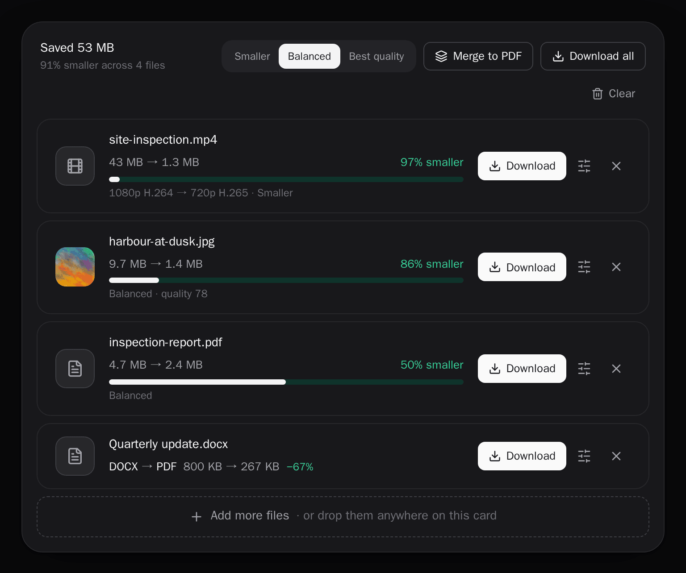
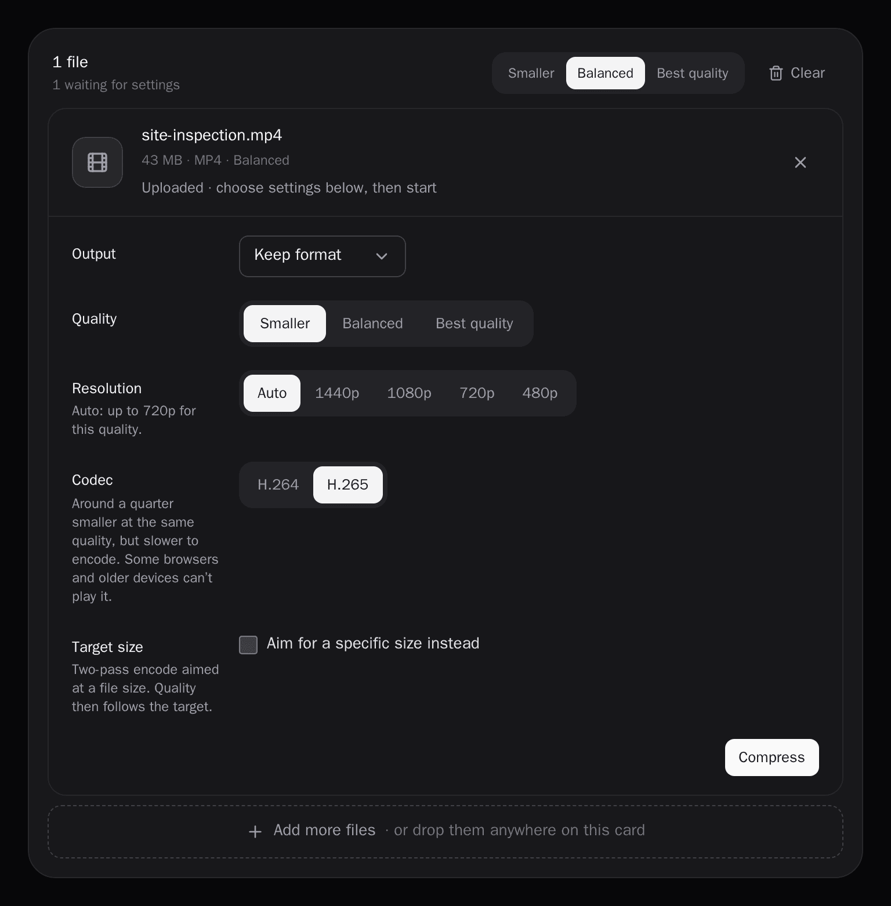
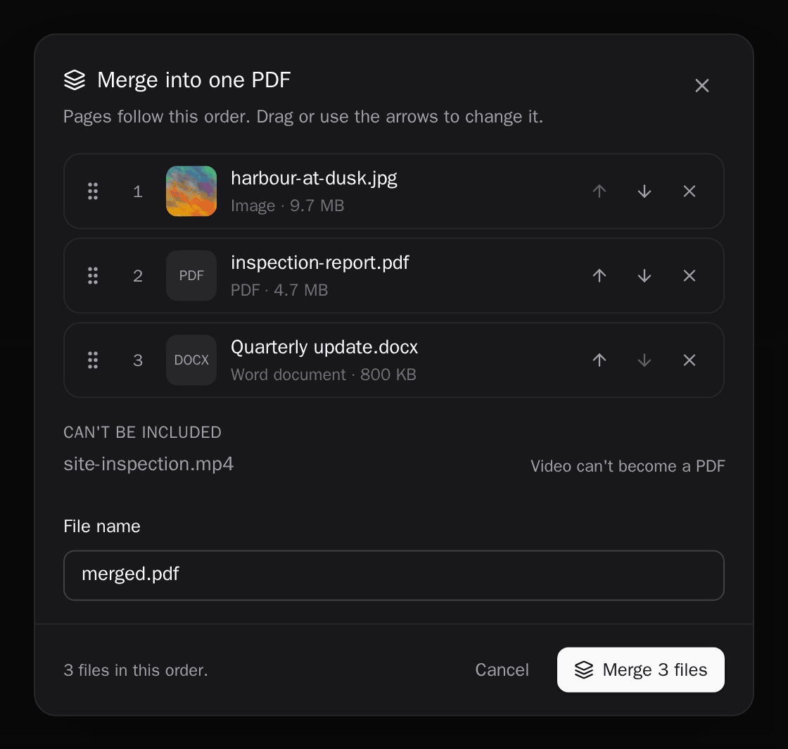
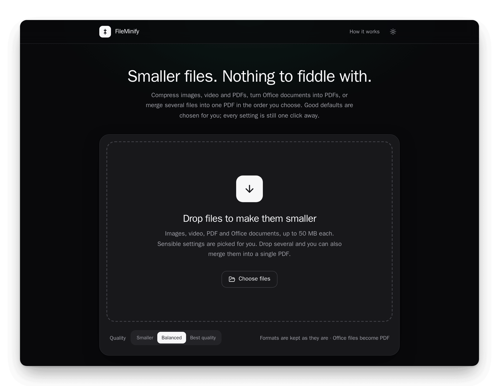
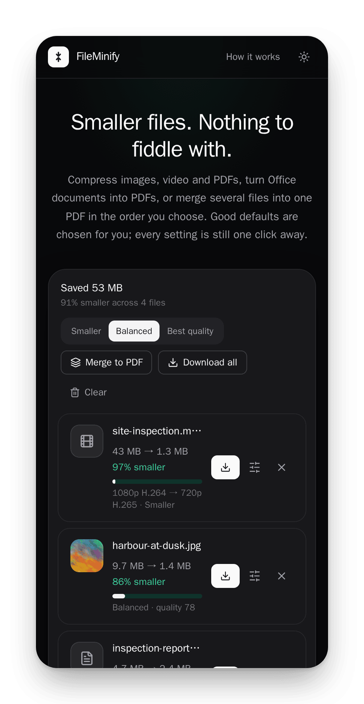

<h1 align="center">FileMinify</h1>

<p align="center">
  <strong>Smaller files. Nothing to fiddle with.</strong><br>
  A self-hosted web app that compresses images, video and PDFs, turns Office documents
  into PDFs, and merges anything printable into one PDF.
</p>

<p align="center">
  <a href="https://github.com/bardurnielsen/file-minify/actions/workflows/docker-build.yml"></a>
  <a href="LICENSE"></a>
  
</p>

<p align="center">

</p>

Drop files in and images, PDFs and documents are processed straight away; videos
wait for one click, so you can aim for a file size or pick a resolution first. Every
result says what was done to it, and nothing leaves the machine you run it on.

Frontend is React + TypeScript, backend is Node/Express wrapping FFmpeg,
Ghostscript, ImageMagick, Sharp and LibreOffice. Everything runs in Docker.

## What it does

**Compression** — images (JPG, PNG, WebP, GIF), PDFs, and video (MP4, WebM, MOV,
AVI). One control, three tiers: *Smaller*, *Balanced* (default), *Best quality*.
The tier maps onto whatever each encoder actually understands, so it does something
real in every case rather than sending a number that gets ignored.

For video each tier also sets a resolution (*Smaller* up to 720p, *Balanced* up to
1080p, *Best quality* up to 1440p, never enlarged — nothing is kept at 4K, since a
smaller file is the point) and caps the bitrate at a share of the source's, so every
tier is a real step down even for an already-lean clip. Per file you can pick the
resolution yourself, switch to H.265 (MP4/MOV; about a quarter smaller, slower to
encode, not playable everywhere), or aim at a target size instead — handy for
getting a clip under an email attachment limit.

<p align="center">

</p>

Office files become PDFs at the chosen tier, and every PDF Ghostscript writes is
then repacked losslessly into compressed object streams.

**Conversion** — only between formats that genuinely work, derived from one table
(`src/formats.ts`) that mirrors the backend:

| Source | Can become |
| --- | --- |
| Image | JPG, PNG, WebP, GIF, PDF |
| PDF | JPG, PNG, WebP, GIF |
| Video | MP4, WebM, MOV, AVI |
| Word / Excel / PowerPoint | PDF |

A file is never offered its own format, or one its type cannot reach — a PNG has no
route to MP4, so the option does not appear.

**Merge to PDF** — combine 2–20 files into one PDF in an order you control by
dragging. Images, PDFs and Office documents can all take part; video cannot become
a PDF and is listed as excluded with the reason. If any one file fails to convert,
nothing is merged and the response names the file, rather than quietly handing back
a document with a piece missing.

<p align="center">

</p>

**Labelled results** — a download's name says what was done to it, e.g.
`clip-720p-h265-smaller.mp4`, `clip-720p-h264-9mb.mp4` or `scan-balanced.pdf`. The
same goes inside the file (a comment in videos, the description in images, the
Producer in PDFs) and on the result row ("4K HEVC → 720p H.265 · Smaller"). Nothing
else from the source's metadata is kept, so a phone's GPS location does not travel
with a file you email. Phone photos are turned upright before their orientation tag
is dropped.

**Rename and share** — tap a file's name to rename it before it leaves (a phone
camera clip arrives as `1000123456.mp4`); the label is kept, so it goes out as
`pump-3-leak-720p-h265-smaller.mp4`. Where the browser supports it, **Share** hands a
finished file, all of them at once, or the merged PDF straight to the phone's share
sheet — email, chat — without saving it first. Browsers only allow that on a secure
page (HTTPS or `localhost`), and phones only share certain types (MP4 and WebM video,
images, PDF), so the button appears only where it will work; Download is always there.

**Honest results** — when re-encoding would make a file *larger* (already-optimised
PDFs and video often do), the original is kept and reported as-is instead of being
presented as a saving. A PDF that needs a password to open is refused with a clear
error rather than coming back as a blank page.

Files are processed in place and deleted by an hourly sweep once they are an hour
old. There is no account, no database, and nothing leaves the machine you run it on.

## Requirements

Docker and Docker Compose. Nothing else — Node is not needed on the host, since
both images build and run inside Docker.

## Install

```bash
git clone https://github.com/bardurnielsen/file-minify.git
cd file-minify
docker compose up -d --build
```

Then open **http://localhost:3051**. It works the same from a phone on your network,
and can be installed as an app (Chrome or Edge: *Install app*; Android: *Add to Home
screen*), opening full-screen with its own icon. Browsers only offer that over HTTPS,
or on `localhost`, so a server reached by plain `http://` needs HTTPS in front of it.

<p align="center">

&nbsp;

</p>

The first build takes a while — the backend image installs LibreOffice, FFmpeg,
Ghostscript and ImageMagick, around 970 MB of packages. Later builds are cached and
take seconds.

```bash
docker compose logs -f backend     # follow the backend log
docker compose down                # stop
docker compose down -v             # stop and delete uploaded files
```

### Ports

Defined in `docker-compose.yml`; the app is on **3051** and the API on **4001**.
(The offset from 3050/4000 dates from running beside the first version of
FileMinify, now retired.) Change the left-hand side of each mapping to move them.

Only 3051 is published to the network. The API is bound to `127.0.0.1:4001` for
the smoke suite and for debugging from the host — nginx reaches the backend over
the Compose network, so nothing else needs it, and publishing it would be a second
front door that skips nginx and the rate limiting.

### On Windows, without Docker

For one PC at home there is a native Windows build, no Docker needed:

```powershell
winget install BardurNielsen.FileMinify
```

Winget brings FFmpeg, ImageMagick, LibreOffice and the VC++ runtime along with
it, and asks for administrator rights for those. FileMinify itself installs
for the current user only. Start it from the Start menu: a console window
opens (close it to stop FileMinify) and the app opens in the browser at
**http://localhost:3051**.

- **Only this PC can reach it**, unless *Let phones and other computers on this
  network use FileMinify* is ticked in the installer. With that ticked, the
  console window lists the address to use, and Windows asks once to let it
  through the firewall (allow *Private networks*).
- **SmartScreen may warn on first run**, because the installer isn't
  code-signed. Choose *More info* → *Run anyway*.
- **Settings** (for example `MAX_FILE_SIZE=200MB` or `PROCESS_TIMEOUT_MIN=60`) go
  in `%LOCALAPPDATA%\FileMinify\settings.env`, one `KEY=value` per line. The
  defaults match the ship's server: 500 MB per file and 30 minutes per job.
- The installer is also on the [Releases](https://github.com/bardurnielsen/file-minify/releases)
  page. Installed that way, add the tools yourself:
  `winget install Gyan.FFmpeg ImageMagick.ImageMagick TheDocumentFoundation.LibreOffice Microsoft.VCRedist.2015+.x64`.

## Development

Both services build from the repo root. After editing:

```bash
docker compose up -d --build frontend   # frontend only
docker compose up -d --build backend    # backend only
```

The frontend image build runs `tsc -b && eslint . && vite build`, so a successful
build is also the type check and lint. Two test suites run against the running
stack, and CI runs both on every PR:

```bash
./backend/test/smoke.sh            # API: upload, compress, convert, merge, security
./e2e/run.sh                       # browser: the whole app in Chromium (Playwright)
```

The browser suite runs in Microsoft's Playwright image, so nothing is installed
on the host; the first run downloads it (about 2.5 GB). Test videos are made
by the backend's ffmpeg. `./e2e/run.sh -- --grep merge` runs a subset, and a
failure leaves a trace in `e2e/test-results/` to open at trace.playwright.dev.

The screenshots in this README are generated, not taken by hand:
`./e2e/screenshots/update.sh` rebuilds all of them from the running stack with demo
files, so they can be refreshed whenever the UI changes.

Docker is the only supported way to run it: the backend needs FFmpeg, Ghostscript,
ImageMagick and LibreOffice, and the images pin all of them.

## API

The frontend talks to these directly; nginx proxies `/api/*` to the backend,
stripping the prefix.

| Method | Path | Purpose |
| --- | --- | --- |
| `POST` | `/upload` | multipart, field `files`, up to 10 files of 50 MB. Returns an `id` per file |
| `POST` | `/compression/:id` | `{quality, format}`; for video also `maxSize` (target MB), `codec` (`h264`\|`h265`) and `resolution` (`1440`\|`1080`\|`720`\|`480`) → sizes and ratio |
| `GET` | `/compression/download/:id` | the compressed bytes |
| `POST` | `/conversion/:id` | `{format}`, plus `quality` for Office → PDF → sizes and formats |
| `GET` | `/conversion/download/:id` | the converted bytes |
| `POST` | `/merge` | `{ids: [...]}`, 2–20, merged in the order given → `{id, size, pageCount, fileCount}` |
| `GET` | `/merge/download/:id` | the merged PDF |
| `DELETE` | `/upload/:id` | discard an upload |
| `GET` | `/health` | `{"status":"ok"}` |
| `GET` | `/config` | `{maxFileBytes, maxFiles}`, the server's upload limits |

`format` is a target format, or `original` (or omitted) to keep the source's.
`quality` is 1–100 for images and `low`\|`medium`\|`high` for everything else.

Errors are `{success: false, error: "..."}`. A password-protected PDF is a `422`. A
merge that fails on one file also returns `failedId` naming it.

## Configuration

Per-server settings go in a `.env` file next to `docker-compose.yml` — copy
[`.env.example`](.env.example). All are optional; `docker compose up -d` applies a
change without a rebuild, and tracked files stay untouched, so `git pull` stays
clean.

| Setting | Default | Meaning |
| --- | --- | --- |
| `MAX_FILE_MB` | `50` | largest upload, per file. A phone records roughly 150 MB per minute of 1080p, 300–400 MB per minute of 4K |
| `PROCESS_TIMEOUT_MIN` | `5` | time allowed for each ffmpeg / Ghostscript / LibreOffice command. nginx's timeout follows from it |
| `BACKEND_CPU_SHARES` | `512` | CPU weight against other containers (Docker default 1024). Only matters when the CPU is busy. The kernel weight it maps to varies by runtime (512 → 59 on newer runc, 20 on older); `bench.sh` prints it |
| `TEMP_DIR` | named volume | a host directory for uploads and results, instead of a volume under `/var/lib/docker`. Must be dedicated (everything older than an hour is deleted) and writable by uid 1000 |

The upload limit is enforced by the backend, mirrored into nginx at startup, and
reported to the browser by `GET /config`, so it is only ever set in one place.

`CORS_ORIGIN` (in `docker-compose.yml`, empty by default) opts extra origins in,
comma-separated; the app itself needs none.

### Sizing a server

`./backend/test/bench.sh` times every quality tier and codec on the host it runs
on, through the real API, with a generated phone-like clip or your own
(`./backend/test/bench.sh clip.mp4`, `BENCH_SECONDS=120` for a longer one). Pick
`PROCESS_TIMEOUT_MIN` so the slowest setting you care about fits with margin at
the longest clip `MAX_FILE_MB` allows. Run it once idle and once while the
server's other work is busy: the backend's low CPU weight means it deliberately
slows down then.

Compose also caps each container: 3 GB for the backend, 128 MB and half a CPU for
nginx, with `restart: unless-stopped` and health checks on both, so a heavy batch
cannot take the host with it and a reboot brings the app back.

The backend has no CPU cap on purpose. `cpus:` is not a limit that degrades —
Docker refuses to start the container at all when the value exceeds the host's
core count, so a number chosen on one machine stops the app dead on a smaller
one. Transcoding is also the whole job here, so throttling it mostly slows the
people using the app. Add one by hand if you want it, no higher than `nproc`.

## Notes on running this publicly

This is built for your own machine or a private network. What is in place:
Helmet, per-file type and size validation, rate limiting (600 requests per 15
minutes per client IP, counted from `X-Forwarded-For`), same-origin enforcement,
and resource caps on both containers.

Before exposing it beyond a trusted network, be aware:

- Uploads are unauthenticated. Anyone who can reach the app can spend CPU on video
  encoding — the container limits bound the damage, they do not prevent it.
- Temporary files are readable by any request that can guess a UUID.
- There is no TLS here; put it behind a reverse proxy that terminates HTTPS.

If you do front it with another proxy, pass the original `Host` header through
(`proxy_set_header Host $http_host`). The same-origin check compares the request's
`Origin` against it, and a proxy that rewrites `Host` will make the app reject its
own requests.

## Licence

MIT — see [LICENSE](LICENSE).

The Windows installer also carries an unmodified copy of GPL Ghostscript, which
is AGPL v3. Its licence and a pointer to its source are installed beside it
(`tools\gs\`).
